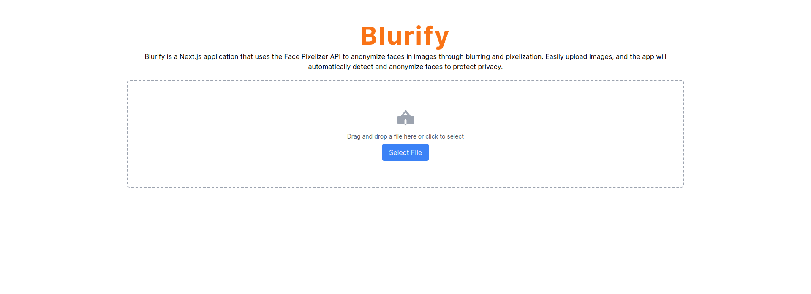
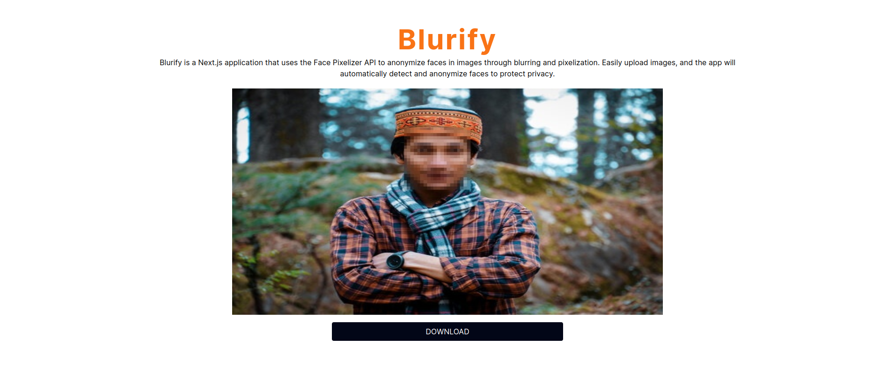
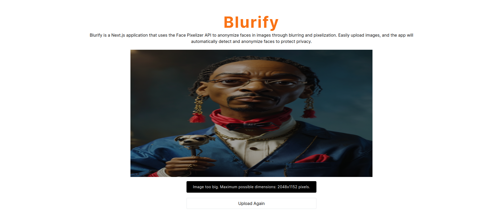

# Anonymize Faces App

Anonymize Faces App is a Next.js application that uses the Face Pixelizer API to anonymize faces in images through blurring and pixelization. Easily upload images, and the app will automatically detect and anonymize faces to protect privacy.

## Features

- Upload images directly from your device.
- Automatically detect and anonymize faces in the uploaded images.
- Display the original and anonymized images.

## Getting Started

### Prerequisites

Ensure you have the following installed on your system:

- Node.js (>= 12.x)
- npm (>= 6.x)

### Installation

1. Clone the repository:

   ```bash
   git clone https://github.com/sudeepmi/anonymize-faces-app.git
   cd anonymize-faces-app
   ```

2. Install the dependencies:

   ```bash
   npm install
   ```

3. Create a `.env.local` file in the root directory and add your Face Pixelizer API key:

   ```env
   API_KEY=your_api_key_here
   ```

### Running the App

Start the development server:

```bash
npm run dev
```

Open your browser and navigate to [http://localhost:3000](http://localhost:3000) to see the app in action.

## Screenshots


*Upload an image with a clear face.*


*The face is blurred.*


*The face is not blurred from the image. Errors*

## Usage

1. Drag and drop an image onto the upload area or click to select an image from your device.
2. The app will upload the image to the Face Pixelizer API.
3. The anonymized image will be displayed below the upload area.

## Dependencies

- [Next.js](https://nextjs.org/)
- [React](https://reactjs.org/)
- [Axios](https://github.com/axios/axios)
- [React Dropzone](https://react-dropzone.js.org/)

## Contributing

Contributions are welcome! Please open an issue or submit a pull request for any improvements or bug fixes.

## License

This project is licensed under the MIT License. See the [LICENSE](LICENSE) file for details.

## Acknowledgments

- Thanks to the developers of the Face Pixelizer API for providing an easy-to-use service for face anonymization.

